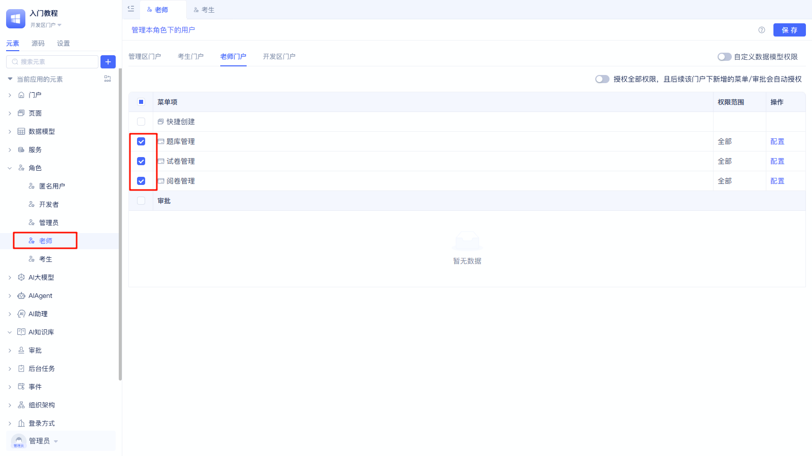
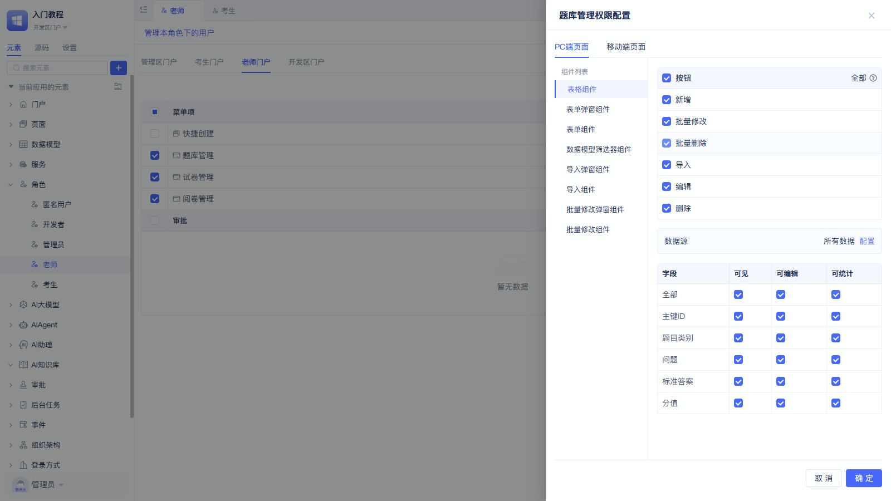
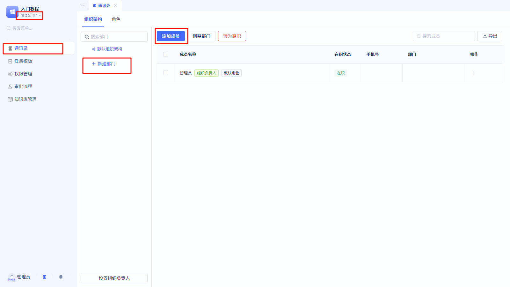
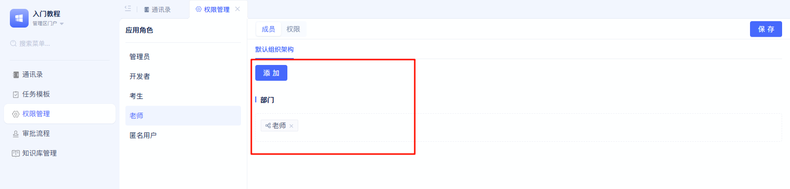

# 用应用角色实现权限控制

## 效果展示

import VideoPlayer from '@site/src/components/VideoPlayer';

<VideoPlayer relatePath="/docs/tutorial/role_effect.mp4" />

## 实现过程

JIT应用框架中，已经内置了「开发者」、「管理者」2种角色，并分别对应「开发者门户」、「管理者门户」。

在本项目中，有2种角色： 老师、考生。
因为前面我们已经针对这2种角色分别创建了「老师门户」、「考生门户」，所以接下来权限配置就很简单。

### 在「开发者门户」中创建应用角色和管理权限范围

也可以针对每个菜单，点击右边「配置」，进一步配置每个组件的权限，可以精准控制每个按钮、每个字段、读写权限等等。

### 在「管理者门户」中管理组织、配置人员

本应用中，我们创建「老师」部门、「学生」部门。

阅读[组织架构](../../devguide/user-and-permission/organizational-structure)了解更多。

### 在「管理者门户」中配置每个角色包含哪些成员

在「老师」角色下成员配置里面添加「老师」部门；在「考生」角色下成员配置里面添加「考生」部门

阅读[角色与门户菜单权限](../../devguide/user-and-permission/role-portal-menu-permissions)了解更多。