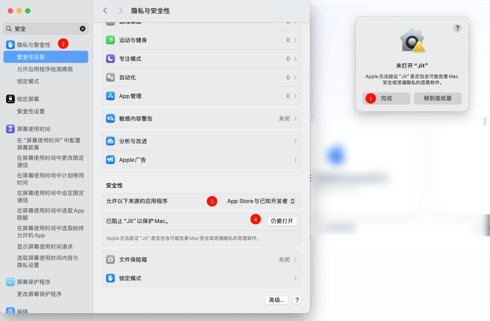

# 下载安装

JitAi安装包分为桌面版（支持Windows、Mac）和服务器版（提供Docker镜像）。

## 桌面版

用于开发者在个人电脑上开发、运行、调试、发布应用。

根据操作系统类型，桌面版分为 Windows 安装包 和  Mac 安装包。

### Windows

适用于 Windows 10（64 位）、Windows 11 （64 位）的操作系统。

安装步骤：

1. [点击此处下载](https://apk.jit.pro/latest/windows/jit.exe)安装包。
2. 双击exe文件安装。
3. 按页面流程激活。 阅读[开发者组织管理](../devguide/installation-activation/developer-organization-management)了解更多细节。

### Mac

适用于 MacOS 12.6.0 (Monterey) 及以上版本。

安装步骤：

1. 下载安装包： [Intel芯片安装包](https://apk.jit.pro/latest/darwin/x64/jit.dmg)，[Apple芯片安装包](https://apk.jit.pro/latest/darwin/arm/jit.dmg)。
2. 双击dmg文件安装。
3. 按页面流程激活。阅读[开发者组织管理](../devguide/installation-activation/developer-organization-management)了解更多细节。

:::warning
如果提示安全性问题，点击"完成"按钮，进入系统设置->隐私与安全性->安全性，将"允许以下来源的应用程序"设置为"App Store与已知开发者"，点击`仍要打开`。


:::

## 服务器版

用于部署在服务器上运行应用系统（多进程、支持集群、高性能），可用作应用系统的测试环境和生产环境。也支持在线开发，但不支持后端代码调试。目前服务器版安装包只支持通过 Docker 安装。

### 安装步骤

1. 按 [Docker 官方文档](https://docs.docker.com/manuals/)安装 Docker。

2. 通过以下命令运行 JitNode 容器：

   ```bash
   docker run -itd --name jit \
     -p 80:80 \
     -p 3306:3306 \
     --init --privileged \
     -v /your/local/path:/data/JitNode \
     jitaiplatform/jit
   ```
   请将 /your/local/path 替换为宿主机实际路径，例如：/Users/username/JitNode 或 /opt/jitnode

   :::tip 中国用户提示
   中国用户可以使用阿里云镜像以获得更快的下载速度：
   ```bash
   docker run -itd --name jit \
     -p 80:80 \
     -p 3306:3306 \
     --init --privileged \
     -v /your/local/path:/data/JitNode \
     registry.cn-hangzhou.aliyuncs.com/jitpro/jit
   ```
   :::

3. 在浏览器中访问 `http://{服务器IP地址}:80`，按页面流程激活。阅读[开发者组织管理](../devguide/installation-activation/developer-organization-management)了解更多细节。


### 容器参数说明

| 是否必填 | 参数 | 说明 |
|---------|------|------|
| **必填** | `--name {ContainerName}` | 指定容器名称 |
| **必填** | `-p {WebPort}:80` | 指定 Web 服务对外暴露的端口号 |
| **必填** | `-p {MySQLPort}:3306` | 指定 JitNode 内置 MySQL 对外暴露的端口号，新建应用时默认使用该数据库存储数据 |
| **选填** | `-p {RedisPort}:6379` | 指定 JitNode 内置 Redis 对外暴露的端口号 |
| **选填** | `-e NODE_ADDRESS={URL}` | 用于部署集群环境时配置当前节点地址，集群节点之间转发请求时通过该地址转发到当前节点。可不配置，进入 admin 后在界面中配置 |
| **选填** | `-v {LocalDir}:/data/JitNode` | 容器中 `/data/JitNode` 目录存储：节点许可证信息、MySQL 数据、Redis 数据、node.json、运行环境配置等数据。用于备份/迁移运行环境数据 |

```bash title="完整参数启动命令示例"
docker run -itd --name jitnode \
  -p 80:80 \
  -p 3306:3306 \
  -p 6379:6379 \
  -e NODE_ADDRESS=http://your-server-ip:80 \
  --init --privileged \
  -v /your/local/path:/data/JitNode \
  jitaiplatform/jit
```

## 常见问题

安装完成后，建议您详细了解 JitAi 的目录组织架构，以便更好地进行后续开发和管理工作，请参阅 [JitNode目录](../reference/runtime-platform/jitnode-directory) 。

<details>
<summary>桌面版启动失败？</summary>

请先确认本地没有进程占用8080端口。

</details>

<details>
<summary>怎样修改运行的端口号？</summary>

修改 `JitProjects/node.json` 中的 PORT 值。默认是 8080。

</details>

<details>
<summary>新建应用的源码存储在哪里？</summary>

桌面版存储在 `JitProjects/environs` 文件夹下，Docker版存储在 `/data/JitNode/home/environs`

</details>


<details>
<summary>安装包有新版本怎么办？</summary>

针对服务器版，AdminApp会在页面顶部提示安装包依赖更新信息，点击即可自动重启更新。如果是Docker镜像更新，则需要用户手动拉取新版本镜像，并使用新镜像重新启动容器，映射目录保持和旧版本一致即可。

针对桌面版，需要手动关闭Jit并重新启动。

</details>