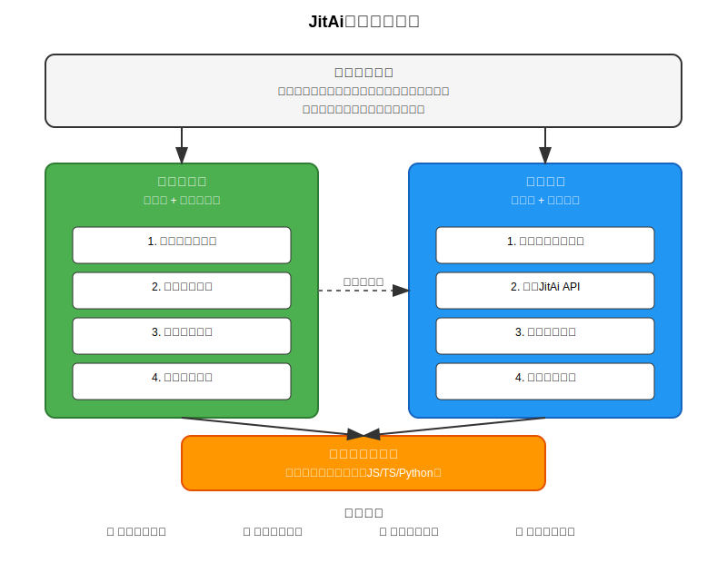

# 对比JitAi与主流AI应用平台

## 为什么选择JitAi？

> 想象一下，如果AI不仅能回答你的问题，还能像懂行的同事一样，直接帮你操作业务系统、调整工作流程，甚至在前端页面上和你一起工作，那该多好？JitAi就是这样一个平台，它让AI从"工具"变成了真正的"智能工作伙伴"。

目前市场上存在众多AI开发平台，如Coze、Dify、n8n等，这些平台确实降低了AI应用开发的门槛。然而存在一个关键问题：这些平台构建的AI应用往往局限于特定场景的解决方案，缺乏与现有业务系统的深度集成能力。

以传统AI应用为例，虽然AI助手具备强大的分析能力，但受限于接口交互模式，无法直接访问业务系统内部数据，只能基于用户提供的有限信息进行响应，其实际价值受到严重制约。

JitAi采用不同的技术路径，通过解释型系统架构，使AI能够深度理解业务系统的内部结构和运行逻辑。AI不仅具备业务逻辑理解能力，还能直接操作系统功能，在前端界面实现人机协同工作，真正成为智能化的业务伙伴。

接下来我们将深入分析JitAi的技术实现原理，以及其与传统AI开发平台的核心差异。

## JitAi独有技术优势

### 六大独有技术突破

**1. 让AI真正懂你的业务 - 解释型系统**

JitAi的**解释型系统**是**行业首创**的技术突破，专门为AI时代设计的应用工程技术。通过独创的JAAP协议，AI能够"透视"整个业务系统，直接理解业务模块的结构、功能和相互关系，实现与业务系统的深度融合。

JAAP协议使得应用系统成为可被AI动态感知、动态加载、实时编排、精确调度的智能环境，把传统应用生态带入AI驱动和实时编排时代。AI助理不仅能回答业务问题，还能根据实际情况智能调整业务流程，如同拥有专业业务专家提供支持。而且JitAi的AI可以直接操作前端页面，不是简单的后端API调用，能够与用户在前端页面进行密切的人机协作，这是其他平台都没有的能力。

**2. 应用继承机制 - 工业级复用能力**

JitAi的应用继承机制让模块功能可以重复使用，实现一次开发，多处复用，避免重复开发。我们有200+现成元素，涵盖Web开发(门户、页面、前端组件、 I18N、后端服务、数据模型、数据库、审批、事件、任务、缓存、 对象存储等)和AI开发(大模型、 向量数据库、RAG知识库、 AIAgent、AI助理等)的各种元素都封装好了，开箱即用。可以重写替换继承的元素，重写后实时编译，立即生效。

**3. 矩阵型元素架构 - 编排式开发框架**

JitAi的矩阵型元素架构基于高集成度的编排式编程框架，让业务层应用以实体编排为主，复杂度和工程量降低90%。通过元素自描述协议（JAAP协议），每个元素都能自动描述自己的功能和接口，让AI能够理解和使用。各个组件之间互不影响，可以随意搭配，支持灵活组合，具备高度可配置性。开发者还可以自定义新的元素族类，支持完全自定义扩展。这种编排式开发方式显著提升开发灵活性，大大降低了开发复杂度。

**4. 双模开发 - 图形化编排+代码开发**

JitAi支持图形化编排和编程的开发方式，使开发迭代速度提升10倍，让开发者从容应对生产级AI应用的复杂多变。拖拽开发不用写代码，拖拽就能做出应用，而且拖拽出来的不是需要黑盒引擎解释运行的DSL，而是真正的代码（js/ts/python）。
当可视化开发无法满足需求时，可直接进行代码开发。生成的代码直接就能运行，不需要特殊解释器，既能快速做原型，也能深度定制。

**5. 实时编译引擎 - 边改边看，立即生效**

JitAi的实时编译引擎让你可以支持实时编辑和预览，修改后立即生效，无需等待编译过程，大大提升了开发效率。类似于文档编辑的即时保存和预览功能。

**6. 自动化运维 - 简化部署和更新**

JitAi提供完整的自动化运维工具，大幅简化发布、部署和更新流程。无需关注复杂的服务器配置细节，专注于业务逻辑开发就行，大大降低了运维成本和技术门槛。

### JitAi的核心技术优势

传统的AI应用开发有个问题：AI只能通过接口和你的业务系统"对话"，如同盲人摸象，仅能获取系统暴露的有限信息，无法理解系统内部的业务逻辑。

而JitAi让AI能够"透视"整个业务系统，真正理解你的业务逻辑。这为AI提供了深度洞察能力，让它能看到系统内部的所有细节，从"工具使用"变成"智能协作"。

**核心差异**：传统AI平台主要提供专业工具功能，解决特定场景问题；而JitAi是一个完整的开发平台，支持从前端到后端的全栈业务系统开发。

### AI如何深度理解业务系统并与人密切协作？

JitAi通过以下方式，让AI能够深度理解业务系统并与人密切协作：

1. **人机密切协作**：AI助理支持真正的人机交互，AI将处理结果反馈给用户，用户基于结果指导AI的后续操作，实现人机协同的密切协作模式。

2. **事件驱动协作**：AI在运行过程中会在关键环节触发事件（比如任务开始前、完成后、工具调用前后、任务暂停、人员操作后等），前端页面和后端都可以订阅这些事件并做出相应处理。这样AI和系统就能实时同步，协同工作。

3. **智能工具调用**：每个功能模块都通过JAAP协议对外暴露接口，这些接口都能被AI感知并作为工具调用，包括前端页面中的各种操作。AI可灵活调用各类功能模块，实现按需使用。

这些方式相互配合，共同实现了AI对业务系统的深度理解和与人的密切协作。

## 技术能力对比

### 核心问题解决方案对比

#### 问题1：如何让AI理解你的业务系统？

| 平台 | 解决方案 | 技术实现 | 效果 |
|:---|:---:|:---:|:---|
| **JitAi** | 解释型系统 | JAAP协议，AI透视业务内部 | AI深度理解业务逻辑 |
| **Coze** | API调用模式 | 通过接口获取业务数据 | 基础业务数据交互 |
| **Dify** | 工作流编排 | 画布式流程设计 | 业务流程自动化 |
| **n8n** | 节点连接 | 系统间数据流转 | 跨系统数据集成 |

*核心差异：JitAi是完整的开发平台，其他平台主要提供专业工具功能*

#### 问题2：如何让AI和人一起工作？

| 平台 | 解决方案 | 技术实现 | 效果 |
|:---|:---:|:---:|:---|
| **JitAi** | 深度协同模式 | AI直接操作业务功能 | 真正的智能伙伴协作 |
| **Coze** | 对话交互模式 | 聊天机器人式交互 | 基础问答交互 |
| **Dify** | 代理工作模式 | AI代理执行任务 | 任务自动化执行 |
| **n8n** | 流程触发模式 | 事件驱动工作流 | 自动化流程执行 |

#### 问题3：如何提高开发效率？

| 平台 | 解决方案 | 技术实现 | 效果 |
|:---|:---:|:---:|:---|
| **JitAi** | 拖拽+代码开发 | 图形化编排+写代码，边改边看，一键部署 | 开发效率提升10倍 |
| **Coze** | 可视化开发 | 拖拽式界面设计 | 快速做原型 |
| **Dify** | 画布编排 | 可视化工作流设计 | 复杂流程编排 |
| **n8n** | 节点连接 | 拖拽式节点连接 | 快速搭建流程 |

### 技术能力对比

| 能力 | JitAi | Coze | Dify | n8n | 说明 |
|:---|:---:|:---:|:---:|:---:|:---|
| **业务理解能力** | ✅ 深度理解 | ⚠️ 接口交互 | ⚠️ 接口交互 | ❌ 无 | AI对业务系统的理解程度 |
| **人机协作能力** | ✅ 深度协作 | ⚠️ 基础对话 | ⚠️ 基础对话 | ❌ 无 | AI作为工作伙伴的能力 |
| **前端操作能力** | ✅ 直接操作 | ❌ 不支持 | ❌ 不支持 | ❌ 不支持 | AI操作用户界面的能力 |
| **开发方式** | ✅ 拖拽+代码 | ❌ 不支持 | ⚠️ 只能画布 | ⚠️ 只能节点 | 业务层开发能力 |
| **开发效率** | ✅ 10倍提升 | ✅ 快速原型 | ⚠️ 需要技术 | ⚠️ 需要技术 | 开发效率对比 |
| **代码质量** | ✅ 原生代码 | ⚠️ 封装代码 | ⚠️ 封装代码 | ⚠️ 封装代码 | 生成代码的可维护性 |
| **实时预览** | ✅ 立即生效 | ❌ 不支持 | ❌ 不支持 | ❌ 不支持 | 动态调整能力 |
| **一键部署** | ✅ 全自动 | ⚠️ 基础部署 | ⚠️ 需要配置 | ⚠️ 需要配置 | 运维自动化程度 |
| **扩展能力** | ✅ 工业级 | ⚠️ 模块化 | ⚠️ 组件化 | ⚠️ 节点化 | 系统扩展能力 |

## 总结

### 其他平台：各有所长的"专业师傅"

想象一下，你要装修房子：
- **Coze** 就像个"快速装修师傅"，能快速给你搭个样板间，但细节还得自己来
- **Dify** 就像个"高级装修师傅"，能帮你做复杂的定制装修，但需要专业指导才能发挥最大效果
- **n8n** 就像个"管道工"，专门负责连接各种水管电路，但不会设计整体布局

每个都很专业，但都只能解决一部分问题。你需要找好几个师傅，还得自己当"包工头"协调。

### JitAi：一站式的"智能建筑公司"

JitAi则如同一家具备完整资质的智能建筑公司：

**协作模式**：不仅是一个开发工具，更是一个理解业务逻辑的智能伙伴。用户与AI在同一工作环境中进行实时协作。

**业务理解能力**：传统平台的AI缺乏业务上下文理解，只能执行指令。JitAi的AI具备深度业务理解能力，能够主动识别业务场景，智能调用相应接口，并提供业务建议。

**从设计到交付**：前端界面、后端逻辑、数据库设计、API接口、部署运维...一条龙服务。无需在多个工具间频繁切换，也无需处理数据格式兼容性问题。

### 核心差异：从"用AI"到"与AI协作"

**传统方式**：你 → 告诉AI要做什么 → AI执行 → 你检查结果

**JitAi方式**：你 ↔ AI ↔ 业务系统，三方实时协作

从"工具使用"转变为"智能协作"。AI不再是冷冰冰的工具，而是真正理解你业务、能够深度协作的智能伙伴。

这就是为什么说JitAi重新定义了AI应用开发——它让AI从"好用的工具"真正变成了"懂你的工作伙伴"。

